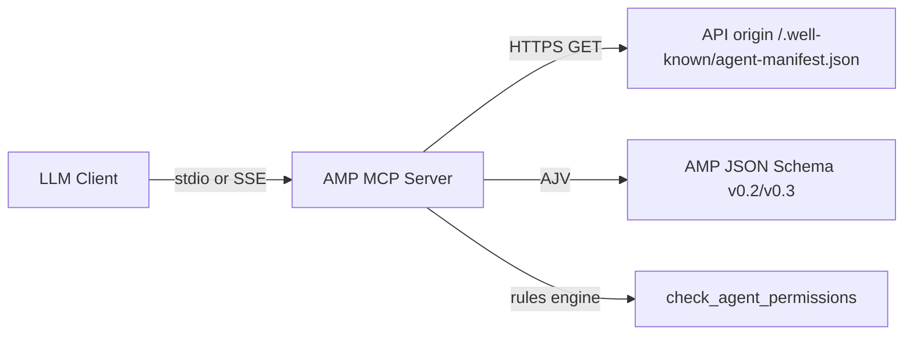

# Agent Manifest Protocol (AMP) — Official MCP Server

[](https://modelcontextprotocol.io)
[](https://agent-manifest.com)

Turn AMP’s **static web discovery** (`/.well-known/agent-manifest.json`) into **runtime MCP tools** so any LLM client (Claude Desktop, Cursor, Smithery, etc.) can discover APIs, validate manifests, and reason about legal/operational boundaries before calling them.

## How AMP complements MCP

| Layer | Role |
| --- | --- |
| **MCP** | Transport and tool surface between the model and your server |
| **AMP** | Publisher-hosted manifest describing endpoints, auth, pricing/payment, rate limits, and `agent_notes` for autonomous agents |

This server does **not** replace calling third-party APIs. It helps agents **decide whether and how** to call them in line with the publisher’s declared contract.

## Tools

### `fetch_manifest_by_domain`

Fetches and parses a manifest from an API origin.

**Input**

```json
{
  "domain": "bakebase.agent-manifest.com"
}
```

**Behavior**

1. Normalizes the host (strips scheme/path).
2. Tries, in order:
   - `/.well-known/agent-manifest.json` (canonical, RFC 8615)
   - `/.well-known/amp.json`
   - `/agent-manifest.json`
3. Returns `manifest`, `manifest_url`, `origin`, and `tried_urls`.

### `validate_manifest_syntax`

Validates JSON against the official AMP schema for `agentmanifest-0.2` or `agentmanifest-0.3`.

**Input (object)**

```json
{
  "manifest": {
    "spec_version": "agentmanifest-0.3",
    "name": "My API",
    "...": "..."
  }
}
```

**Input (string)**

```json
{
  "manifest": "{\"spec_version\":\"agentmanifest-0.3\",...}"
}
```

**Output**

- `valid: true` → `success_token` like `amp-schema-valid:agentmanifest-0.3:My API`
- `valid: false` → `errors[]` with AJV paths/messages

### `check_agent_permissions`

Checks an intended HTTP operation against a manifest’s declared endpoints and constraints.

**Input**

```json
{
  "action": "POST /baking/validate-mix",
  "manifest": { "...": "full manifest object from fetch_manifest_by_domain" },
  "intends_unauthenticated": false,
  "payment_onboarded": false
}
```

**Output**

- `verdict`: `compliant` | `violation` | `warning` | `unknown`
- `findings[]`: structured codes (`endpoint_not_declared`, `auth_required`, `payment_onboarding`, `agent_notes_usage_restriction`, …)
- `matched_endpoint` when a declared route matches (including `{id}` templates)

## Install & run locally

### Prerequisites

- Node.js **18+**
- Build the validator dependency once (local monorepo path):

```bash
cd agentmanifest/amp-mcp && npm install && npm run build
# or from monorepo root:
cd agentmanifest && npm install && npm run build --workspace=amp-mcp
```

### Stdio (Cursor, Claude Desktop, CI)

```bash
npx -y @agentmanifest/mcp-server
# or after linking locally:
node dist/index.js
```

### SSE HTTP hub (remote / agent-manifest.com)

```bash
PORT=8787 HOST=0.0.0.0 npm run start
# GET  http://localhost:8787/mcp      — establish SSE stream
# POST http://localhost:8787/messages?sessionId=... — JSON-RPC from client
```

Environment variables:

| Variable | Default | Purpose |
| --- | --- | --- |
| `PORT` | `8787` | HTTP listen port |
| `HOST` | `0.0.0.0` | Bind address |
| `AMP_MCP_SSE_PATH` | `/mcp` | SSE endpoint |
| `AMP_MCP_MESSAGES_PATH` | `/messages` | POST endpoint |
| `AMP_ALLOWED_HOSTS` | `agent-manifest.com,...` | Host header allow list |
| `AMP_FETCH_TIMEOUT_MS` | `15000` | Manifest fetch timeout |

> **Note:** The MCP SDK marks legacy **HTTP+SSE** as deprecated in favor of Streamable HTTP. This package implements **SSE** as requested for broad client compatibility; you can add Streamable HTTP alongside later using `StreamableHTTPServerTransport`.

## Claude Desktop configuration

Add to `claude_desktop_config.json` (macOS: `~/Library/Application Support/Claude/claude_desktop_config.json`):

```json
{
  "mcpServers": {
    "agent-manifest-protocol": {
      "command": "node",
      "args": ["/absolute/path/to/AMP/amp-mcp/dist/index.js"],
      "env": {
        "AMP_FETCH_TIMEOUT_MS": "15000"
      }
    }
  }
}
```

After publishing to npm, replace with:

```json
{
  "mcpServers": {
    "agent-manifest-protocol": {
      "command": "npx",
      "args": ["-y", "@agentmanifest/mcp-server"]
    }
  }
}
```

## Cursor

**Settings → MCP → Add server → Command:**

- Command: `node`
- Args: `/path/to/amp-mcp/dist/index.js`

Or use `npx -y @agentmanifest/mcp-server` once published.

## Smithery

This repo includes [`smithery.yaml`](./smithery.yaml) for one-command Smithery installs. Point Smithery at this package directory or published GitHub repo; optional env:

- `AMP_FETCH_TIMEOUT_MS`
- `AMP_VALIDATOR_URL` (reserved for future remote validation helpers)

## Registries (official MCP Registry, Smithery, npm)

Docs: **[REGISTRY.md](./REGISTRY.md)** and **[modelcontextprotocol.io/registry/about](https://modelcontextprotocol.io/registry/about)**.

The MCP Registry holds **metadata** (`server.json`); npm holds the package; Railway holds the remote URL. Host apps often discover you via **aggregators** that sync the registry — not by scraping your site.

```bash
brew install mcp-publisher   # see registry quickstart
cd amp-mcp
# package.json mcpName must match server.json "name"
mcp-publisher login github   # or DNS/HTTP for com.agent-manifest/*
mcp-publisher publish
```

## Development

```bash
npm run dev          # SSE server with tsx watch
npm run dev:stdio    # stdio server
npm test
```

## Architecture



## License

MIT © Agent Manifest Protocol
